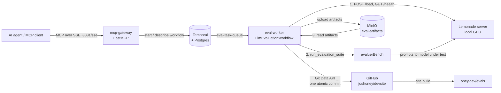

[](https://github.com/joshoney/Crucible/actions/workflows/ci.yml)

# Crucible

Crucible lets an AI agent benchmark a local LLM end to end with a single tool call. The agent calls an MCP tool; a Temporal-orchestrated workflow provisions the model on a local [Lemonade](https://github.com/lemonade-sdk/lemonade) server, runs [evaluerBench](https://github.com/joshoney/evaluerBench) against it, stores the artifacts in MinIO, and publishes them to my site repo as one atomic Git commit. The results are public at **https://oney.dev/evals**. I built it so model evaluation on my own GPU runs unattended and recovers from failures, without me babysitting a script.

- Results: https://oney.dev/evals
- Project page: https://oney.dev/crucible
- Eval harness: https://github.com/joshoney/evaluerBench

> [!WARNING]
> **Security:** Crucible is meant to run on local hardware on a private network, with no ports exposed to the internet. The MCP gateway has **no authentication** by design, and MinIO uses the **default `minioadmin` credentials**. Do not expose these ports publicly. Scope `GITHUB_TOKEN` to the one results repo.

## Architecture



The workflow (`eval-orchestrator/workflow.py`) runs these activities:

1. **`run_evaluation`**: in one attempt, sends `POST {LEMONADE_API_URL}/load`, checks that `GET {LEMONADE_API_URL}/health` lists the model, then calls `evaluerBench.main.run_evaluation_suite(...)` with heartbeat and cancel callbacks. It uploads what this attempt wrote to MinIO under `<task_id>/attempt-<n>/` and returns a **manifest** of exactly those object keys.
2. **`publish_results`**: on success only, reads the manifest's keys from MinIO, builds a Git tree, and moves `TARGET_BRANCH` forward with one commit (or does nothing if HEAD already has identical content).
3. **`cleanup_scratch`**: deletes the local scratch dir once the results are in MinIO and git.

On failure, `record_outcome` writes `<task_id>/failure.json` and the workflow fails with the evaluation's own error. On cancellation, completed runs are published as a partial result, `<task_id>/cancelled.json` is written, and the workflow ends `CANCELED`.

## Quickstart

Prerequisites: Docker with Compose, a Lemonade server the stack can reach, and a GitHub token that can write to the results repo.

```bash
cp .env.example .env      # then fill in the values
docker compose up -d --build
```

| Service | Host port | Purpose |
|---|---|---|
| mcp-gateway | 8081 | MCP SSE endpoint: `http://localhost:8081/sse` |
| temporal | 7233 | Temporal gRPC |
| temporal-ui | 8080 | Workflow history: http://localhost:8080 |
| minio | 9000 / 9001 | S3 API / web console |
| postgresql | 5433 | Temporal persistence |

The eval-worker image clones evaluerBench at `EVALUERBENCH_REF` (default `main`) and runs `npm ci` at build time. Set `EVALUERBENCH_REF` to a commit SHA for reproducible runs. With a branch ref, pick up new commits with `docker compose build --no-cache eval-worker`.

### Connect an MCP client

Point any MCP client that supports SSE at the gateway. If the client runs on a different machine, replace `localhost` with the gateway host's LAN address.

```json
{
  "mcpServers": {
    "crucible": {
      "type": "sse",
      "url": "http://localhost:8081/sse"
    }
  }
}
```

### MCP tools

| Tool | Arguments | Returns |
|---|---|---|
| `test_model` | `model_name: str`, `config: dict \| None` (merged into the Lemonade `/load` body) | `{"task_id": "eval-<model>-<8 hex>", "status": "IN_PROGRESS"}` |
| `get_evaluation_status` | `task_id: str` | `{"task_id", "status", "temporal_status"}`. `status` is `IN_PROGRESS`, `COMPLETED`, `FAILED` (failed, terminated, or timed out), `CANCELLED`, or `UNKNOWN` |
| `get_evaluation_results` | `task_id: str` | `{"task_id", "status", "result"}`. For a completed task, `result` is the workflow result (attempt, published files, commit); otherwise it is the live summary, e.g. what a cancelled task published |
| `cancel_evaluation` | `task_id: str` | `{"task_id", "status": "CANCEL_REQUESTED"}`. Runs that already completed are still published, marked partial |

Errors (unknown task ID, Temporal unreachable, cancelling a finished task) are raised as MCP tool errors, not returned as strings. The taskID is also the Temporal workflow ID, so you can open the same run in the Temporal UI.

## Configuration

[`.env.example`](.env.example) lists every variable, with a comment for each. `docker-compose.yml` passes them to `eval-worker`. The gateway needs only `TEMPORAL_URL`, which compose sets.

| Variable | Used by | Notes |
|---|---|---|
| `LEMONADE_API_URL` | worker | e.g. `http://10.10.0.12:8000/api/v1` |
| `TARGET_BASE_URL` | evaluerBench | Endpoint for the model under test. Defaults to `LEMONADE_API_URL` |
| `EVALUATOR_BASE_URL`, `EVALUATOR_API_KEY`, `EVALUATOR_MODEL` | evaluerBench | Judge model |
| `LANGCHAIN_API_KEY` | evaluerBench | Optional LangSmith tracing |
| `GITHUB_TOKEN`, `GITHUB_REPO`, `TARGET_BRANCH` | worker | Where results are published. `TARGET_BRANCH` defaults to `main` |
| `LEMONADE_VERIFY_LOADED` | worker | Check that `/health` lists the model before evaluating. Default `true`; a server without the loaded-model fields skips the check |
| `SCRATCH_RETENTION_DAYS` | worker | Failed or cancelled scratch dirs older than this are deleted when an eval starts. Default `7`; `0` disables |
| `SCRATCHPAD_ROOT` | worker | Local scratch root. Default `/app/scratchpad` (the bind mount) |
| `EVALUERBENCH_REF` | image build | evaluerBench branch, tag, or commit SHA. Default `main` |

## Results layout

evaluerBench defines this layout: results are grouped by model, then by eval, then by run. Each eval runs separately, because multi-eval runs timed out on small hardware, so there is no "run" level that groups several evals together.

```
MinIO   eval-artifacts/<task_id>/attempt-<n>/<model>/<evalId>/<timestamp>.json
                                             <model>/<evalId>/artifact-<timestamp>.html
                      <task_id>/manifests/attempt-<n>.json     what attempt n uploaded, and its status
                      <task_id>/failure.json | cancelled.json  final outcome, when not a success

GitHub  src/resources/evaluerBench/<model>/<evalId>/<timestamp>.json
        src/resources/evaluerBench/<model>/<evalId>/artifact-<timestamp>.html
```

The `<task_id>/attempt-<n>` prefix exists only in MinIO, where it keeps each attempt's uploads apart. The publish step drops it, so each new run lands next to earlier runs of the same model and eval. The site (`joshoney/devsite`) renders this tree at https://oney.dev/evals.

## Running tests

Each service has its own unit tests, which mock Temporal, MinIO, GitHub, Lemonade, and evaluerBench. The workflow tests use Temporal's time-skipping test server, which is downloaded the first time it runs. They cover retries with attempt isolation, failure outcomes, heartbeat timeouts, mid-run cancellation, and concurrent submissions. Python dependencies are pinned in `requirements*.txt`.

```bash
cd mcp-gateway        # or eval-orchestrator
pip install -r requirements.txt -r requirements-test.txt
python -m pytest
```

CI (`.github/workflows/ci.yml`) runs both suites on Python 3.11, the same version the Dockerfiles use, plus `ruff check .` (pyflakes and pycodestyle errors, configured in `ruff.toml`).

## Design decisions

- **Temporal.** A local-GPU eval can run for a long time (the activity timeout is 45 minutes), and the Lemonade box can be busy or restarting. Temporal gives each step its own timeout and retry policy and keeps a durable history. A GitHub rate limit retries only `publish_results`, not the whole evaluation.
- **MinIO between steps.** Artifacts (JSON traces, HTML) can be large. Returning them from activities would bloat Temporal's event history, so activities pass only a small manifest of object keys and the bytes stay in object storage.
- **Attempt isolation and a manifest.** Each attempt of `run_evaluation` writes to `SCRATCHPAD_ROOT/<task_id>/attempt-<n>` and uploads to `<task_id>/attempt-<n>/`. It returns a manifest that lists exactly the keys it uploaded. The workflow hands that manifest to `publish_results`, which publishes nothing else. Files from a failed attempt stay in MinIO for debugging but are never published.
- **Explicit outcomes.** Results are published only on success. On failure, `record_outcome` writes `<task_id>/failure.json` (error, attempts, timestamp) and the workflow re-raises the evaluation's own error, so the failure cause in Temporal is the real one. An error while recording the failure never replaces it.
- **Idempotent publish.** Before committing, `publish_results` compares each target path's blob SHA at the branch HEAD with the SHA git would assign the new content (`sha1("blob <len>\0" + bytes)`, computed locally). If every path already matches, it returns `already_published` without a commit, so a retry after a successful ref update doesn't make a duplicate commit. The ref update is never forced. If the branch moved (422), the activity raises a retryable `PublishConflict`, and the retry re-reads HEAD and rebuilds the commit on top of it.
- **Heartbeats.** `run_evaluation` heartbeats with evaluerBench's progress (`on_tick`, at least every 5 s), and also while `/load` blocks. With `heartbeat_timeout=2m`, a hung CLI or a dead worker is detected in about two minutes instead of after the 45-minute timeout. A retry logs how far the previous attempt got, from `heartbeat_details`.
- **Cooperative cancellation.** `cancel_evaluation` cancels the workflow, which cancels the eval activity with `WAIT_CANCELLATION_COMPLETED`, so the activity's cleanup finishes before the workflow moves on. The activity is a sync activity on a thread pool, where Temporal delivers cancellation only through heartbeats. It is declared with `no_thread_cancel_exception=True`, so Temporal never injects an exception into the thread. Instead, evaluerBench polls `should_cancel=activity.is_cancelled`, sends the CLI SIGTERM, and waits a grace period, and the CLI saves its completed runs (marked `"cancelled": true`). The activity uploads them and writes its manifest to MinIO, because Temporal drops the return value of a cancelled activity. If there are any completed runs, the workflow publishes them as a partial result (commit tagged `[partial: cancelled]`). It then writes `cancelled.json` and re-raises, so the run ends `CANCELED`. The worker flushes heartbeats at least every 10 s, which bounds how long a cancel takes to reach evaluerBench.
- **Provision and evaluate in one activity.** The concurrency cap serializes activities, not workflows. With separate provision and evaluate activities, workflow B's provisioning could run between A's two steps, and A would evaluate B's model. One activity per attempt makes that impossible. After `/load`, the activity checks Lemonade's `GET /health` (`model_loaded` and `all_models_loaded[].model_name`) and fails the attempt if the model isn't loaded (`LEMONADE_VERIFY_LOADED`).
- **Alternative considered: a GPU lock workflow.** A long-lived "GPU lock" workflow could hand out leases through signals, so a whole provision, eval, and publish sequence holds the GPU, and it would work across several workers. It adds a second workflow, lease expiry, and starvation handling, which isn't worth it for one host with one worker.
- **Git Data API, not the Contents API.** It makes one tree and one commit for the whole run. The site never shows a half-published result, and each run is a single commit you can revert.
- **`max_concurrent_activities=1`.** There is one local GPU. Two evaluations at once would compete for memory and skew timing results.
- **Gateway decoupled from the worker.** The gateway starts `"LlmEvaluationWorkflow"` by name and reads results from Temporal (the workflow result or its `summary` query). It holds no worker code and no MinIO or GitHub secrets.
- **Scratch cleanup.** `SCRATCHPAD_ROOT/<task_id>` is deleted after a successful publish. Failed and cancelled runs are kept for debugging and removed after `SCRATCH_RETENTION_DAYS`. The sweep only touches dirs that contain `attempt-<n>` subdirs.
- **Pinned builds.** Python dependencies and Docker images are pinned to exact versions. evaluerBench is baked into the image at `EVALUERBENCH_REF` with `npm ci`, so no dependency install runs inside the eval's timeout.

## Known limitations

- **Single worker, single host.** The concurrency cap applies per worker, and the setup assumes one GPU box. The scratch dir and `cleanup_scratch` assume they run on the host that wrote the files. Crucible is Temporal-orchestrated, not a distributed system.
- **No resume within a run.** A retried attempt reruns every eval from scratch; heartbeat details are only logged. Cancellation keeps completed runs but discards the one in progress.
- **Lemonade can evict the model mid-run.** The `/health` check runs once, before evaluerBench starts. If the server then loads another model (for example the judge, on the same server) and its LRU limit evicts the model under test, the eval is affected. Passing `"pinned": true` in `config` asks Lemonade not to evict it.
- **Cancel latency.** A cancel reaches evaluerBench on the next flushed heartbeat (up to about 10 s), plus its SIGTERM grace period (30 s).
- **`temporalio/auto-setup` is deprecated upstream.** It is pinned to its newest tag, `1.29.7`. To migrate, run `temporalio/server` and create the Postgres schemas with `temporal-sql-tool` from `temporalio/admin-tools` (see [temporalio/docker-compose](https://github.com/temporalio/docker-compose)), or use `temporal server start-dev` for a local-only setup.

## Repository layout

```
mcp-gateway/         FastMCP server (main.py) + tests
eval-orchestrator/   Temporal worker, workflow, activities + tests
docker-compose.yml   Full stack: Postgres, Temporal, Temporal UI, MinIO, worker, gateway
.env.example         Configuration template
ruff.toml            Lint rules used by CI
```
