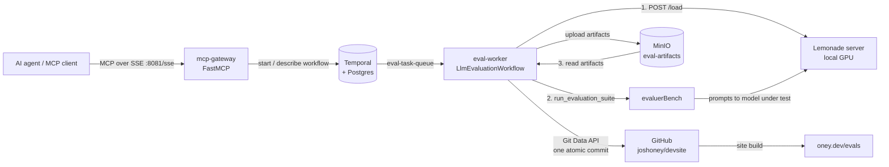

[](https://github.com/joshoney/Crucible/actions/workflows/ci.yml)

# Crucible

Crucible lets an AI agent benchmark a local LLM end to end with a single tool call. The agent calls an MCP tool; a Temporal-orchestrated workflow provisions the model on a local [Lemonade](https://github.com/lemonade-sdk/lemonade) server, runs [evaluerBench](https://github.com/joshoney/evaluerBench) against it, stores the artifacts in MinIO, and publishes them to my site repo as one atomic Git commit. The results are public at **https://oney.dev/evals**. I built it so model evaluation on my own GPU runs unattended and recovers from failures, without me babysitting a script.

- Results: https://oney.dev/evals
- Project page: https://oney.dev/crucible
- Eval harness: https://github.com/joshoney/evaluerBench

> [!WARNING]
> **Security:** Crucible is meant to run on local hardware on a private network, with no ports exposed to the internet. The MCP gateway has **no authentication** by design, and MinIO uses the **default `minioadmin` credentials**. Do not expose these ports publicly. Scope `GITHUB_TOKEN` to the one results repo.

## Architecture



The workflow (`eval-orchestrator/workflow.py`) runs three activities:

1. **`provision_model`**: sends `POST {LEMONADE_API_URL}/load` to load the requested model.
2. **`run_agentic_evaluation`**: calls `evaluerBench.main.run_evaluation_suite(model, output_dir)`, then uploads everything evaluerBench wrote to MinIO under `<task_id>/`.
3. **`publish_results`**: reads `<task_id>/` back from MinIO, builds a Git tree, and moves `TARGET_BRANCH` forward with one commit. This step runs in a `finally` block, so any partial results are published even when the evaluation fails.

## Quickstart

Prerequisites: Docker with Compose, a Lemonade server the stack can reach, and a GitHub token that can write to the results repo.

```bash
cp .env.example .env      # then fill in the values
docker compose up -d --build
```

| Service | Host port | Purpose |
|---|---|---|
| mcp-gateway | 8081 | MCP SSE endpoint: `http://localhost:8081/sse` |
| temporal | 7233 | Temporal gRPC |
| temporal-ui | 8080 | Workflow history: http://localhost:8080 |
| minio | 9000 / 9001 | S3 API / web console |
| postgresql | 5433 | Temporal persistence |

The eval-worker image clones evaluerBench at build time. To pick up new evaluerBench commits, run `docker compose build --no-cache eval-worker`.

### Connect an MCP client

Point any MCP client that supports SSE at the gateway. If the client runs on a different machine, replace `localhost` with the gateway host's LAN address.

```json
{
  "mcpServers": {
    "crucible": {
      "type": "sse",
      "url": "http://localhost:8081/sse"
    }
  }
}
```

### MCP tools

| Tool | Arguments | Returns |
|---|---|---|
| `test_model` | `model_name: str`, `config: dict \| None` (merged into the Lemonade `/load` body) | `Evaluation started. taskID: eval-<model>-<8 hex>` |
| `get_evaluation_status` | `task_id: str` | `IN_PROGRESS`, `COMPLETED`, `FAILED`, or `UNKNOWN_STATE: <status>` |

The taskID is also the Temporal workflow ID, so you can open the same run in the Temporal UI.

## Configuration

[`.env.example`](.env.example) lists every variable, with a comment for each. `docker-compose.yml` passes them to `eval-worker`. The gateway needs only `TEMPORAL_URL`, which compose sets.

| Variable | Used by | Notes |
|---|---|---|
| `LEMONADE_API_URL` | worker | e.g. `http://10.10.0.12:8000/api/v1` |
| `TARGET_BASE_URL` | evaluerBench | Endpoint for the model under test. Defaults to `LEMONADE_API_URL` |
| `EVALUATOR_BASE_URL`, `EVALUATOR_API_KEY`, `EVALUATOR_MODEL` | evaluerBench | Judge model |
| `LANGCHAIN_API_KEY` | evaluerBench | Optional LangSmith tracing |
| `GITHUB_TOKEN`, `GITHUB_REPO`, `TARGET_BRANCH` | worker | Where results are published. `TARGET_BRANCH` defaults to `main` |

## Results layout

evaluerBench defines this layout: results are grouped by model, then by eval, then by run. Each eval runs separately, because multi-eval runs timed out on small hardware, so there is no "run" level that groups several evals together.

```
MinIO   eval-artifacts/<task_id>/<model>/<evalId>/<timestamp>.json
                                 <model>/<evalId>/artifact-<timestamp>.html

GitHub  src/resources/evaluerBench/<model>/<evalId>/<timestamp>.json
        src/resources/evaluerBench/<model>/<evalId>/artifact-<timestamp>.html
```

The `<task_id>` prefix exists only in MinIO, where it keeps one workflow's uploads together. The publish step drops it, so each new run lands next to earlier runs of the same model and eval. The site (`joshoney/devsite`) renders this tree at https://oney.dev/evals.

## Running tests

Each service has its own unit tests, which mock Temporal, MinIO, GitHub, and evaluerBench. The workflow tests use Temporal's time-skipping test server, which is downloaded the first time it runs.

```bash
cd mcp-gateway        # or eval-orchestrator
pip install -r requirements.txt -r requirements-test.txt
python -m pytest
```

CI (`.github/workflows/ci.yml`) runs both suites on Python 3.11, the same version the Dockerfiles use, plus `ruff check .` (pyflakes and pycodestyle errors, configured in `ruff.toml`).

## Design decisions

- **Temporal.** A local-GPU eval can run for a long time (the activity timeout is 30 minutes), and the Lemonade box can be busy or restarting. Temporal gives each step its own timeout and retry policy and keeps a durable history. A GitHub rate limit retries only `publish_results`, not the whole evaluation.
- **MinIO between steps.** Artifacts (JSON traces, HTML) can be large. Returning them from activities would bloat Temporal's event history, so activities pass only a `task_id` and the bytes stay in object storage.
- **Git Data API, not the Contents API.** It makes one tree and one commit for the whole run. The site never shows a half-published result, and each run is a single commit you can revert.
- **`max_concurrent_activities=1`.** There is one local GPU. Two evaluations at once would compete for memory and skew timing results.
- **Gateway decoupled from the worker.** The gateway starts `"LlmEvaluationWorkflow"` by name. It holds no worker code and no secrets, and talks only to Temporal.

## Known limitations

- **Single worker, single host.** The concurrency cap applies per worker, and the setup assumes one GPU box. Crucible is Temporal-orchestrated, not a distributed system.
- **Concurrent workflows can interleave model provisioning.** The cap serializes *activities*, not whole workflows. If workflow A provisions model X and workflow B then provisions model Y, A's evaluation can run against Y. For now, submit one model at a time. A fix would be a per-host lock, or merging provision and evaluate into one activity.
- **Publish runs in `finally`.** Publishing partial results on failure is intentional. But if the evaluation failed before writing anything, `publish_results` raises "No artifacts found", and that error can hide the original failure.
- **Retries are not fully idempotent.** A retried `run_agentic_evaluation` runs evaluerBench again in the same scratch directory, which adds new timestamped files that are then uploaded and published. If `publish_results` fails after the branch ref has been updated, the retry makes a second commit with the same content.
- **Scratch output is never cleaned up.** `./eval-orchestrator/scratchpad/<task_id>` (gitignored) keeps growing on the host through the bind mount.

## Repository layout

```
mcp-gateway/         FastMCP server (main.py) + tests
eval-orchestrator/   Temporal worker, workflow, activities + tests
docker-compose.yml   Full stack: Postgres, Temporal, Temporal UI, MinIO, worker, gateway
.env.example         Configuration template
ruff.toml            Lint rules used by CI
```
